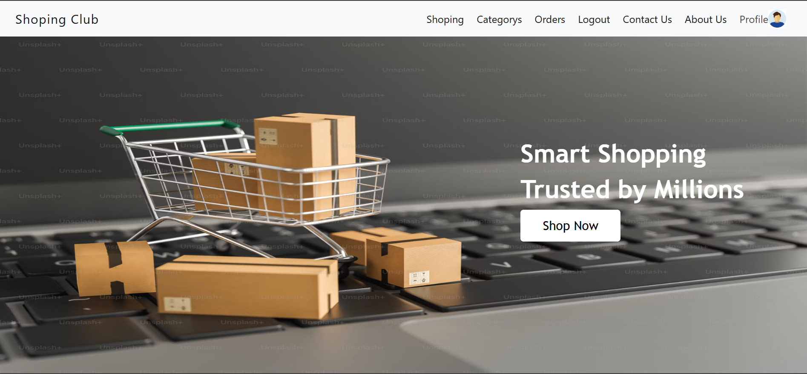
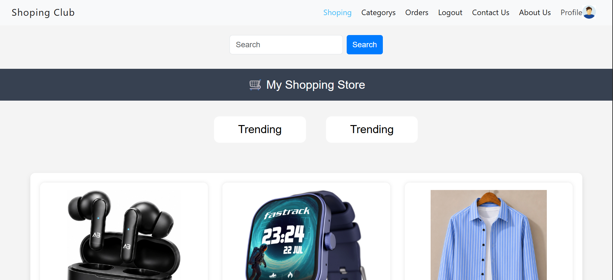
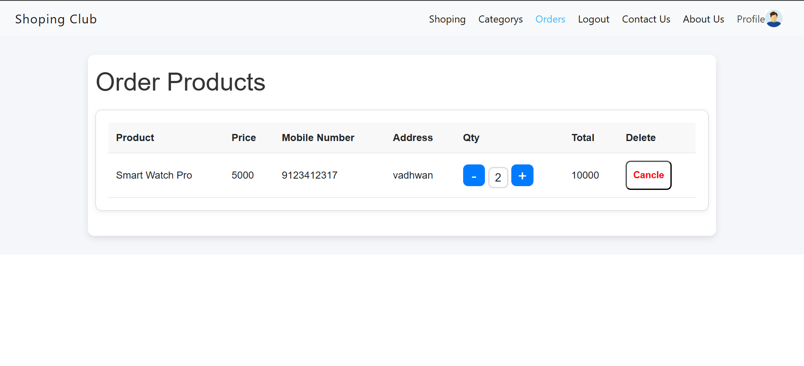
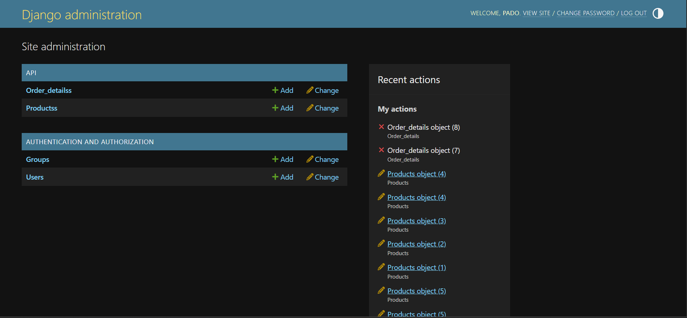

# Shopping Club

An e-commerce/shopping club platform built with Django REST Framework and React. Users can browse products, manage their cart, place orders, and manage their accounts through a modern web interface.

## Features

- User registration and login
- authentication
- Product listing and search
- Product categories
- Shopping cart management
- Order placement
- User profile management
- RESTful API

## Tech Stack

### Backend

- Python
- Django
- Django REST Framework (DRF)
- SQLite
- Authentication

### Frontend

- React
- React Router
- Bootstrap 

## Project Structure

```text
shopping-club/
│
├── backend/
│   ├── manage.py
│   ├── requirements.txt
│   └── apps/
│
├── frontend/
│   ├── src/
│   ├── public/
│   └── package.json
│
└── README.md
```

## API Endpoints

| Method | Endpoint | Description |
|----------|------------|------------|
| POST | /api/register/ | Register User |
| POST | /api/login/ | Login User |
| GET | /api/products/ | Product List |
| GET | /api/productdetails/{id}/ | Product Details |
| POST | /api/orders/ | Create Order |

## Screenshots

### Home Page



### Product Page



### Cart Page



### Admin Dashboard



## Future Improvements

- Online payment integration
- Product reviews and rating
- Email notifications
  
## Author

Your Name

GitHub: https://github.com/Ravi0315

LinkedIn: https://www.linkedin.com/in/makwana-ravi-    b26a64340utm_source=share&utm_campaign=share_via&utm_content=profile&utm_medium=android_app


  
